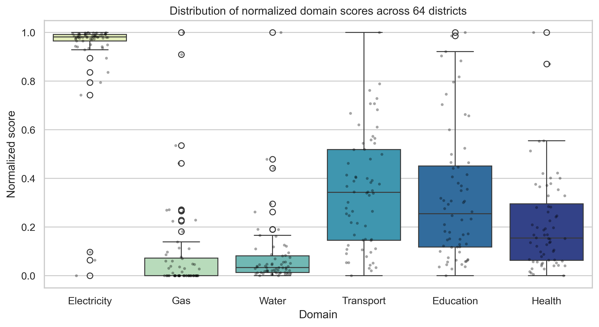
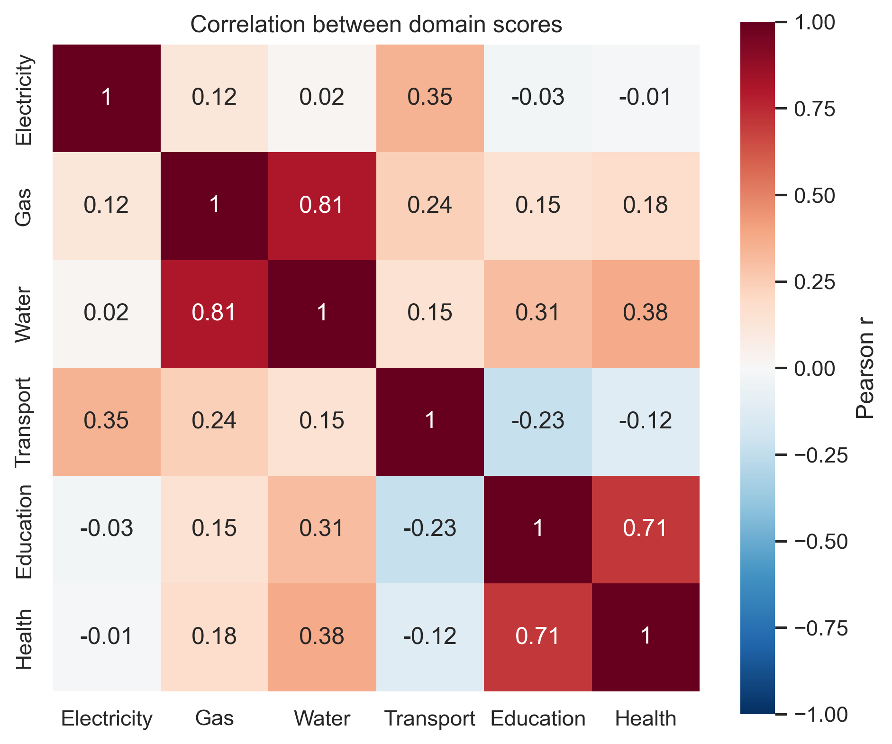
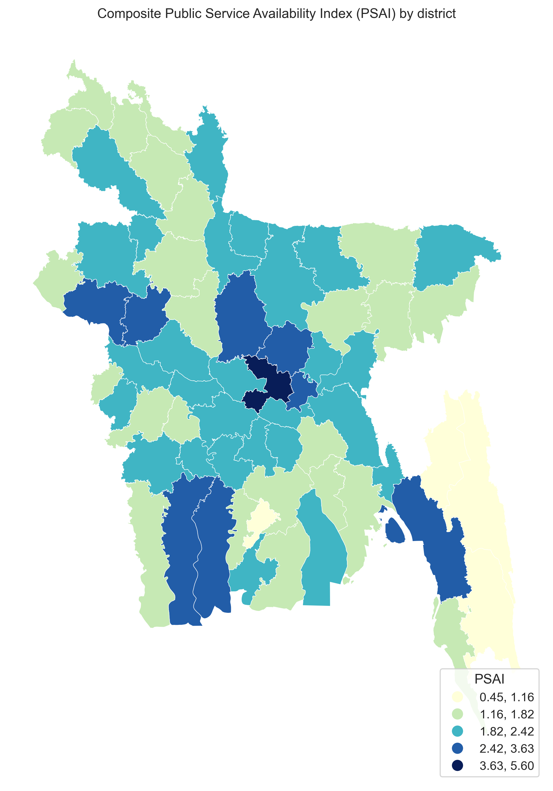
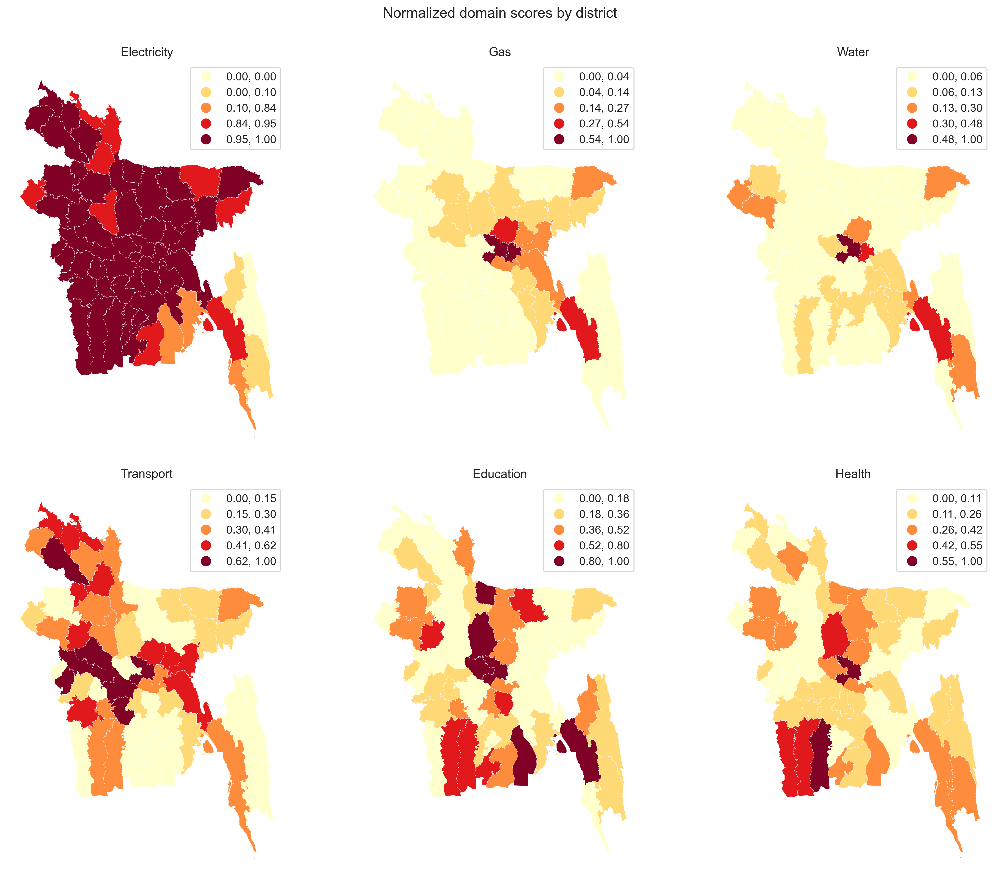
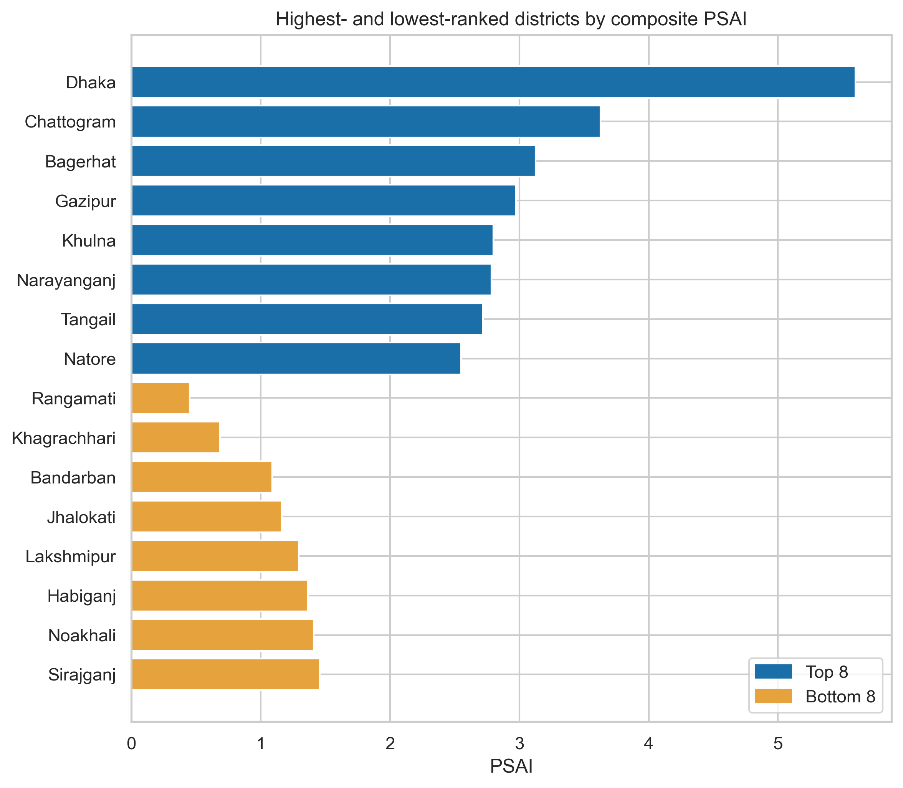
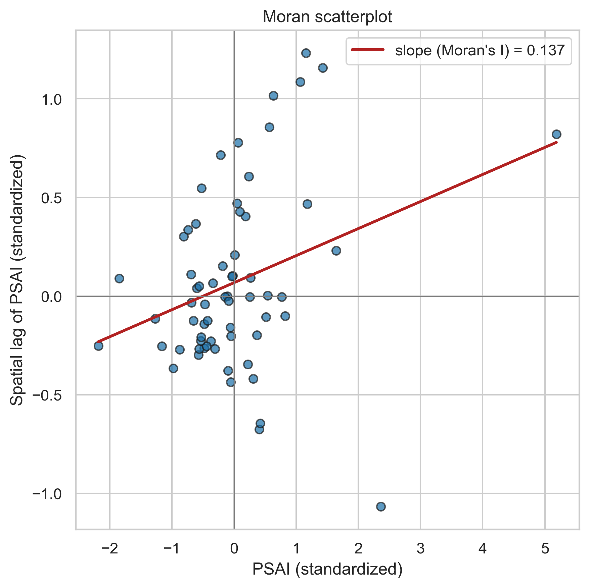
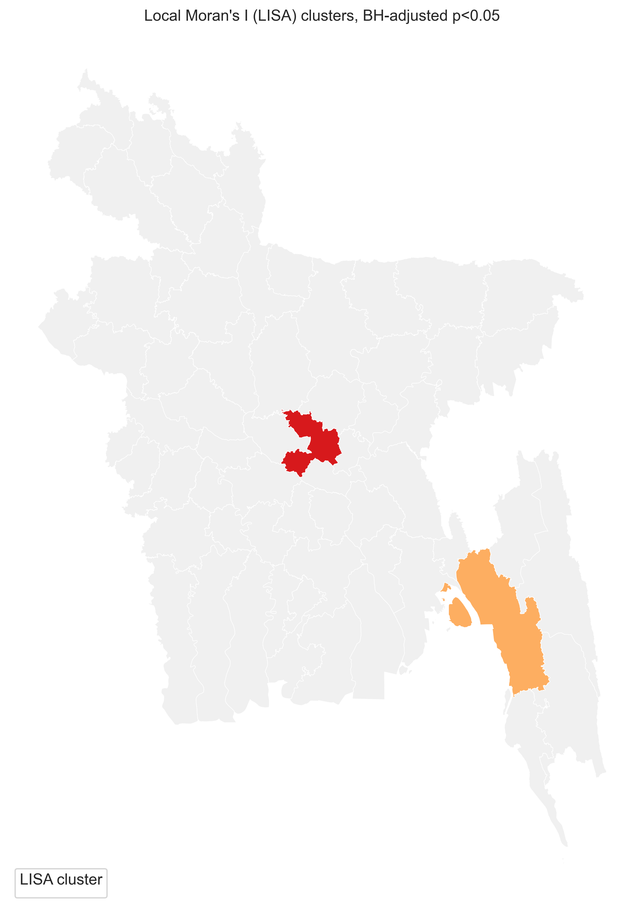
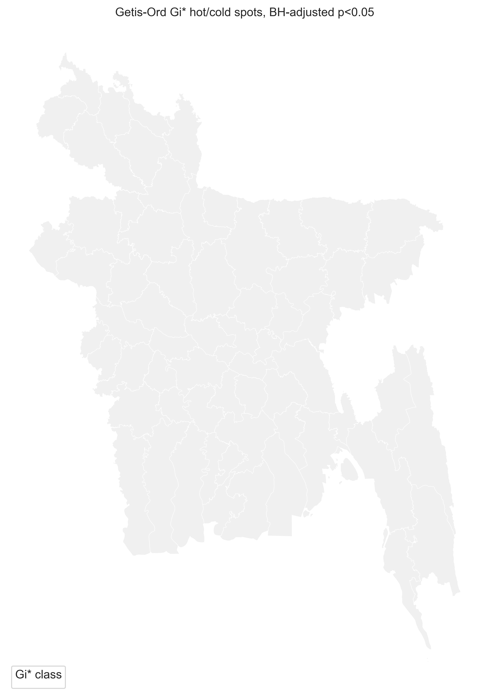

# Public Service Availability Index (PSAI) — Bangladesh

Data, code, and spatial analysis for the **Public Service Availability Index (PSAI)**, a
district-level composite index of recorded public service provision developed for the 64
districts of Bangladesh.

The PSAI combines household indicators from the Population and Housing Census 2022 (Bangladesh
Bureau of Statistics) with facility and network records from OpenStreetMap, across six service
domains — education, healthcare, transportation, electricity, gas supply, and water supply —
normalized and aggregated into a single composite score per district. The repository also
includes the Global and Local Moran's I (LISA) and Getis-Ord Gi* spatial autocorrelation analysis
used to test whether recorded availability is spatially clustered.

This repository accompanies the manuscript *"Constructing a Spatial Public Service Availability
Index (PSAI) for a Developing-Country Context: Development and Spatial Application in
Bangladesh"* (under review). A permanent, versioned archive is available on Zenodo:
**[DOI: 10.5281/zenodo.22921177](https://doi.org/10.5281/zenodo.22921177)**.

## Repository structure

```
├── code/
│   └── PSAI_Full_Analysis.ipynb     # Full Python analysis pipeline
├── gis_project/                     # Original ArcGIS Pro project (provenance only — see note below)
│   ├── PSAI_Analysis.aprx
│   ├── PSAI_Analysis.gdb
│   ├── PSAI_Analysis.atbx
│   └── schema.ini
├── data_raw/
│   ├── Main_datasets.xls            # Source workbook: raw counts, denominators, domain scores
│   ├── geospatial_ana.xls
│   ├── geospatial_ana_proj.xls
│   ├── layout.xls
│   ├── lisa_psai.csv / .xml
│   ├── hotspot-gets-psai.csv / .xml
│   └── schema.ini
├── tables_export/                   # Tables 1–9 as referenced in the manuscript
└── figures_export/                  # Figures 1–8 as referenced in the manuscript (300 dpi)
```

## Important note on the GIS project folder

`gis_project/` contains the original ArcGIS Pro project used during early-stage data preparation
and is retained here **for provenance only**. The spatial-analysis results reported in the
manuscript — Global and Local Moran's I under Queen contiguity weights with 999 conditional
permutations, and Getis-Ord Gi* — were produced by the Python notebook in `code/`, not by this
ArcGIS project. Do not use the ArcGIS outputs as the source of the published statistics.

## Figures

All figures below are generated directly by `code/PSAI_Full_Analysis.ipynb` and are numbered to
match the manuscript.

**Fig. 2.** Distribution of normalized domain scores across the six PSAI domains.


**Fig. 4.** Correlation between domain scores (Pearson correlation).


**Fig. 5.** Composite PSAI by district.


**Fig. 3.** Normalized domain scores by district, mapped individually for all six domains.


**Fig. 6.** Highest- and lowest-ranked districts by composite PSAI.


**Fig. 7.** Moran scatterplot of PSAI (Queen contiguity weights).


**Fig. 8.** Local Moran's I (LISA) clusters, Benjamini-Hochberg adjusted.


**Getis-Ord Gi\* hot spot / cold spot classification** (supplementary; not currently discussed in
the manuscript text).


> Note: figure numbers above follow the manuscript's numbering, not the filename order — the
> filenames reflect the notebook's internal generation sequence.

## Reproducing the analysis

The notebook `code/PSAI_Full_Analysis.ipynb` regenerates every table and figure in the manuscript
directly from `data_raw/Main_datasets.xls`. Required packages: `pandas`, `numpy`, `geopandas`,
`matplotlib`, `seaborn`, `libpysal`, `esda`, `splot`, `mapclassify`, `statsmodels`, `scipy`.

```bash
pip install pandas numpy geopandas matplotlib seaborn libpysal esda splot mapclassify statsmodels scipy
jupyter notebook code/PSAI_Full_Analysis.ipynb
```

## Citation

If you use this dataset or code, please cite both the manuscript and this repository:

> [Author citation once the manuscript is published]
>
> Naeem, S. M. J., Prottay, A. K., Paul, V., Chamok, S. H., & Islam, S. M. T. (2026). *Data and
> code for: Constructing a Spatial Public Service Availability Index (PSAI) for a
> Developing-Country Context* [Data set]. Zenodo. https://doi.org/10.5281/zenodo.22921177

## License

Data and exported outputs are licensed under [CC BY 4.0](https://creativecommons.org/licenses/by/4.0/).
Code (`PSAI_Full_Analysis.ipynb`) is licensed under the [MIT License](LICENSE).
Facility and network data derived from OpenStreetMap remain subject to the
[Open Database License (ODbL)](https://opendatacommons.org/licenses/odbl/).

## Contact

Corresponding author: Ahad Kanak Prottay (ahadkanakprottoy@gmail.com), Urban and Rural Planning
Discipline, Khulna University, Bangladesh.
